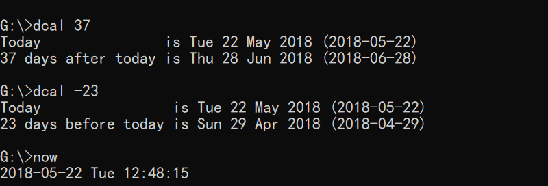

# C++ Snippets 代码片段

## Monte Carlo 模拟

To price various exotic options 用于给各类奇异期权定价

Click [here](monte-carlo)

## LeetCode 题库

Click [here](leetcode)

## Algorithms 算法

Click [here](algorithms) to view all.

For K-means code, click [here](algorithms/kmeans.c)

## Console Programs 控制台程序

Date Calculator 日期计算器

Click [here](console/dcal.cpp)

